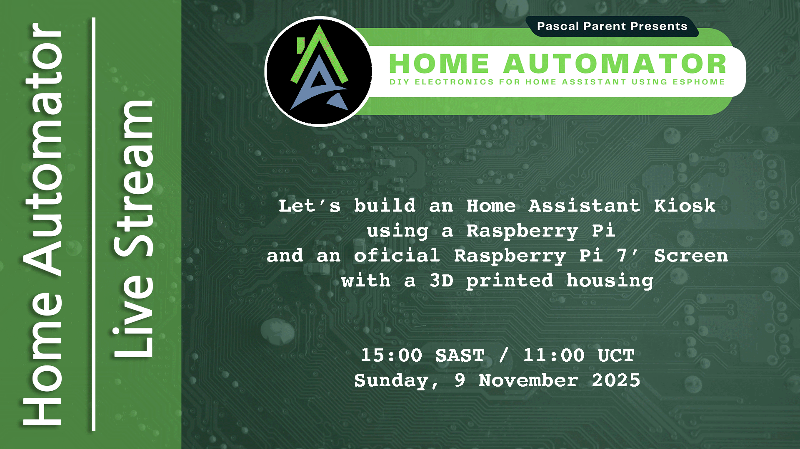

# 2025/11/09 - Let's build a Home Assistant Kiosk

In this livestream we built, installed and configured a Wireless Home Assistant Kiosk with a Raspberry Pi 5 and a Raspberry Pi 7" Touch Display 2.

## Video

## Bill of Materials

- Raspberry Pi 3 or greater, I used a Raspberry Pi 5 4GB
- A compatible touch display, I used a Raspberry Pi 7" Touch Display 2
- A suitable Micro SD Card, I use 32GB+
- A Raspberry Pi power supply, I use the Official 27W PSU for my kiosks.

Optionally:

- Some spare M2.5 screws
- A 3D Printer to print the housing.
- Command strips or simillar if you entend to mount it on the wall as I do.

## Links mentioned in the video

- [Raspberry Pi Imager](https://www.raspberrypi.com/software)
- [Raspberry Pi 7" Touch Display 2 Documentation](https://www.raspberrypi.com/documentation/accessories/touch-display-2.html#connect-to-raspberry-pi)
- [TouchKio Documentation](https://github.com/leukipp/touchkio)
- [HACS Download](https://hacs.xyz/docs/use/download/download/#to-download-hacs)
- [Kiosk Mode Documentation](https://github.com/NemesisRE/kiosk-mode)

## Commands used

### Home Assistant

- ssh username@IPaddress
- sudo apt update
- sudo apt upgate

### TouchKio

- bash <(wget -qO- https://raw.githubusercontent.com/leukipp/touchkio/main/install.sh)
- touchkio --setup

### HACS

-  https://github.com/hacs/addons

### Kiosk Mode
- sudo nano ~/.config/touchkio/Arguments.json

#### You can support me by  
▶ Buying me a tea @ https://www.buymeacoffee.com/homeautomatorza  
▶ Buying me coffee @ https://ko-fi.com/homeautomatorza  
▶ On Patreon @ https://www.patreon.com/homeautomatorza  
